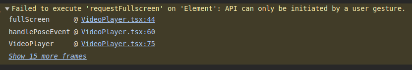

# video-gesture
Een applicatie om je youtube videos te besturen met handgebaren. Dit project is gemaakt voor het vak prg8.

## Scripts

Hier zijn de beschikbare scripts die u kunt uitvoeren:

- `npm run dev`: Start de Vite ontwikkelserver

## huidige issues
Full screen pose niet ondersteund, vanwege de volgende error:

## Afhankelijkheden

Dit project maakt gebruik van de volgende afhankelijkheden:

- `@mediapipe/tasks-vision`: Een MediaPipe taak voor visie gerelateerde taken
- `react`: Een JavaScript bibliotheek voor het bouwen van gebruikersinterfaces
- `react-dom`: React pakket voor het werken met het DOM
- `react-webcam`: Een React component om met de webcam te werken
- `react-youtube`: Een React component voor het weergeven van YouTube video's

## Ontwikkelingsafhankelijkheden

Dit project maakt gebruik van de volgende ontwikkelingsafhankelijkheden:

- `@types/react`, `@types/react-dom`, `@types/youtube-player`: Type definities voor React, ReactDOM en youtube-player
- `@typescript-eslint/eslint-plugin`, `@typescript-eslint/parser`: ESLint plugin en parser voor TypeScript
- `@vitejs/plugin-react`: Vite plugin voor React
- `autoprefixer`: Een tool om CSS te schrijven die door alle browsers wordt ondersteund
- `eslint`, `eslint-plugin-react-hooks`, `eslint-plugin-react-refresh`: ESLint en bijbehorende plugins voor het linten van JavaScript en React code
- `postcss`: Een tool voor het transformeren van CSS met JavaScript
- `tailwindcss`: Een utility-first CSS framework
- `typescript`: Een superset van JavaScript die statische types toevoegt
- `vite`: Een build tool die snelle ontwikkeling en bundeling mogelijk maakt